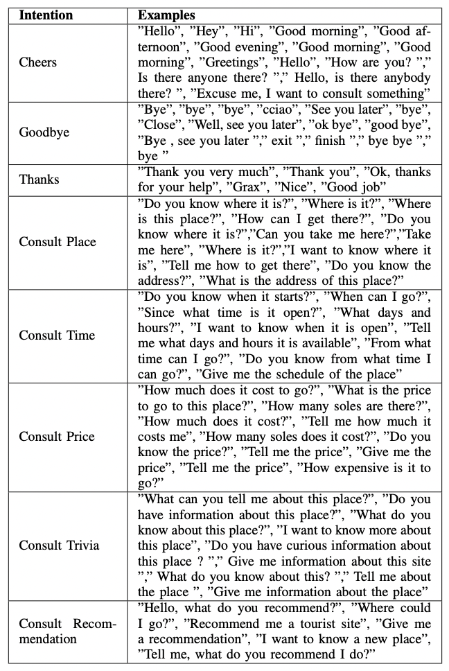

# Chatbot para el proyecto 'Virtual Guide UPC'. 
Usando redes neuronales, nltk y spacy.

## Instalación de las librerías de training.py:
* pip install -U spacy
* python -m spacy download es_core_news_sm

## Instrucciones de uso
* Si el archivo intents.json es modificado, ejecutar training.py, que creará la red neuronal con la nueva matriz de entrenamiento.
* Ejecutar chatbot.py para la demostración del chatbot, usando el modelo 'chatbot_model.model'

## Muestra de los datos de entrenamiento del Chatbot

  

